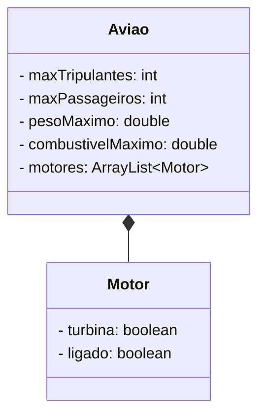
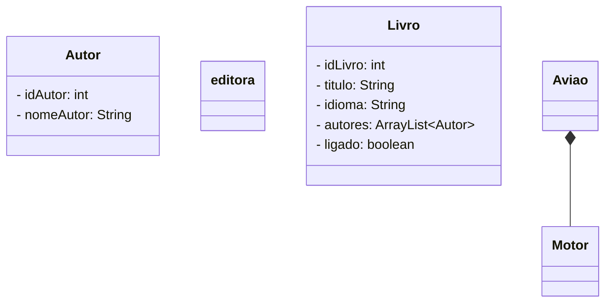

```mermaid
classDiagram
    class Aviao {
    - maxTripulantes: int
    - maxPassageiros: int
    - pesoMaximo: double
    - combustivelMaximo: double
    - motores: ArrayList~Motor~
    }
    class Motor {
    - turbina: boolean
    - ligado: boolean
    }
    Aviao *-- Motor
```

```mermaid
classDiagram
    class Autor {
    - idAutor: int
    - nomeAutor: String
    }
    class editora {
    }
    class Livro {
    - idLivro: int
    - titulo: String
    - idioma: String
    - autores: ArrayList~Autor~
    - ligado: boolean
    }
    Aviao *-- Motor
```